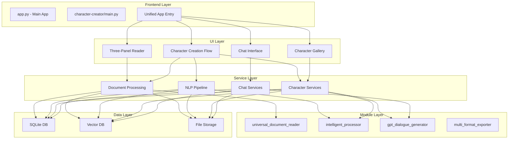

# 🏛️ System Architecture & Integration Map

## 🎯 Two Separate Systems (Currently)

### System 1: Original Document Reader (app.py)
```
app.py (126KB - Monolithic)
    ├── Uses modules/ directly
    ├── Three-panel Adobe-style interface
    ├── Real-time AI processing
    └── Complete document workflow
```

### System 2: Character Creator (character-creator/)
```
character-creator/app/main.py
    ├── Standalone Streamlit app
    ├── Own service architecture
    ├── No imports from modules/
    └── Reimplements some features
```

## 🔴 Current Issues

### 1. **No Integration Between Systems**
- Character creator doesn't use modules/
- Duplicate functionality exists
- Two separate apps, not connected

### 2. **Duplicate Implementations**
```
modules/universal_document_reader.py  ←→  services/document_processor.py
modules/intelligent_processor.py      ←→  services/character_analyzer.py
modules/gpt_dialogue_generator.py     ←→  services/llm_service.py
modules/session_persistence.py        ←→  core/database.py
```

### 3. **Missing Connections**
- Character creator should use:
  - `universal_document_reader.py` for better file support
  - `intelligent_processor.py` for NLP
  - `spacy_theme_discovery.py` for character themes
  - `content_chunker.py` for text segmentation
  - `multi_format_exporter.py` for export

## 🔧 Proposed Integration Architecture



## 📋 Integration Plan

### Phase 1: Unify Document Processing
```python
# character-creator/services/document_processor.py
from modules.universal_document_reader import UniversalDocumentReader
from modules.enhanced_ocr_processor import EnhancedOCRProcessor

class DocumentProcessor:
    def __init__(self):
        self.reader = UniversalDocumentReader()
        self.ocr = EnhancedOCRProcessor()
```

### Phase 2: Integrate NLP Pipeline
```python
# character-creator/services/character_analyzer.py
from modules.intelligent_processor import IntelligentProcessor
from modules.spacy_theme_discovery import SpacyThemeDiscovery

class CharacterAnalyzer:
    def __init__(self):
        self.nlp = IntelligentProcessor()
        self.theme_extractor = SpacyThemeDiscovery()
```

### Phase 3: Unify Chat System
```python
# character-creator/services/llm_service.py
from modules.gpt_dialogue_generator import GPTDialogueGenerator
from modules.llm_output_validator import LLMOutputValidator

class LLMService:
    def __init__(self):
        self.generator = GPTDialogueGenerator()
        self.validator = LLMOutputValidator()
```

### Phase 4: Add Missing Features
```python
# New integrations needed:
- modules/multi_format_exporter → Character export
- modules/async_session_manager → Better performance
- modules/analytics_dashboard → Usage analytics
- modules/visual_dashboard → Character insights
```

## 🗂️ Complete Module Inventory

### Document Processing Modules
1. `universal_document_reader.py` - Multi-format reader
2. `enhanced_ocr_processor.py` - OCR with optimization
3. `docx_renderer.py` - DOCX specific handling
4. `epub_renderer.py` - EPUB specific handling
5. `large_file_ocr_handler.py` - Large file processing

### NLP & AI Modules
6. `intelligent_processor.py` - Core NLP engine
7. `gpt_dialogue_generator.py` - GPT integration
8. `spacy_theme_discovery.py` - Theme extraction
9. `spacy_content_chunker.py` - Smart chunking
10. `smart_content_detector.py` - Content classification
11. `enhanced_tone_manager.py` - Tone analysis
12. `llm_output_validator.py` - Response validation

### UI & UX Modules
13. `ui_state_manager.py` - State management
14. `ui_polish_enhanced.py` - UI enhancements
15. `enhanced_theming.py` - Theme system
16. `auto_preview_system.py` - Preview generation
17. `visual_dashboard.py` - Analytics UI

### Data & Storage Modules
18. `database_manager.py` - DB operations
19. `session_persistence.py` - Session storage
20. `content_chunker.py` - Text chunking
21. `metadata_schema_validator.py` - Data validation

### Export & Integration Modules
22. `multi_format_exporter.py` - Export system
23. `enhanced_universal_extractor.py` - Content extraction
24. `gpt_config_interface.py` - GPT configuration

### Performance & Quality Modules
25. `performance_optimizer.py` - Performance tuning
26. `async_session_manager.py` - Async operations
27. `render_optimization.py` - Render performance
28. `quality_control_enhanced.py` - Quality checks
29. `production_hardening.py` - Production features

### Real-time Processing Modules
30. `realtime_ai_processor.py` - Real-time AI
31. `ai_chat_interface.py` - Chat interface
32. `edit_mode_manager.py` - Edit capabilities

### Analytics & Monitoring
33. `analytics_dashboard.py` - Analytics
34. `enhanced_logging.py` - Logging system
35. `input_validation.py` - Input validation

## 🎯 Recommended Integration Priority

### Critical Integrations (Do First):
1. **Universal Document Reader** → Better file support
2. **Intelligent Processor** → Leverage existing NLP
3. **GPT Dialogue Generator** → Proper LLM integration
4. **Session Persistence** → Better state management

### Important Integrations (Do Second):
5. **Multi-format Exporter** → Character export
6. **Async Session Manager** → Performance
7. **Content Chunker** → Better text processing
8. **Analytics Dashboard** → Usage insights

### Nice-to-Have Integrations:
9. **Visual Dashboard** → Character visualization
10. **Enhanced Theming** → Better UI
11. **Auto Preview** → Document previews
12. **Quality Control** → Content validation

## 🚀 Action Items

### 1. Create Integration Layer
```python
# character-creator/integrations/__init__.py
# Wrapper classes to integrate modules
```

### 2. Update Document Processor
- Replace basic processing with `universal_document_reader`
- Add OCR from `enhanced_ocr_processor`

### 3. Enhance NLP Pipeline
- Use `intelligent_processor` instead of basic spaCy
- Add `spacy_theme_discovery` for better character themes

### 4. Complete LLM Integration
- Implement `gpt_dialogue_generator` in `llm_service.py`
- Add streaming support

### 5. Add Export Capabilities
- Integrate `multi_format_exporter`
- Enable character export as JSON/JSONL

This integration would create a unified, powerful system leveraging all existing capabilities!