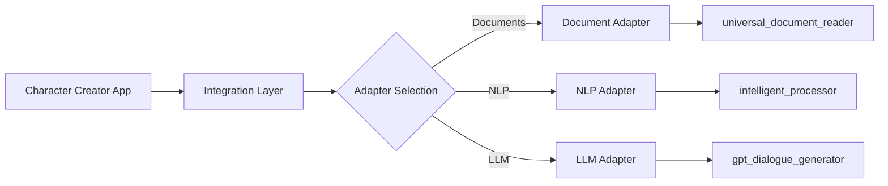
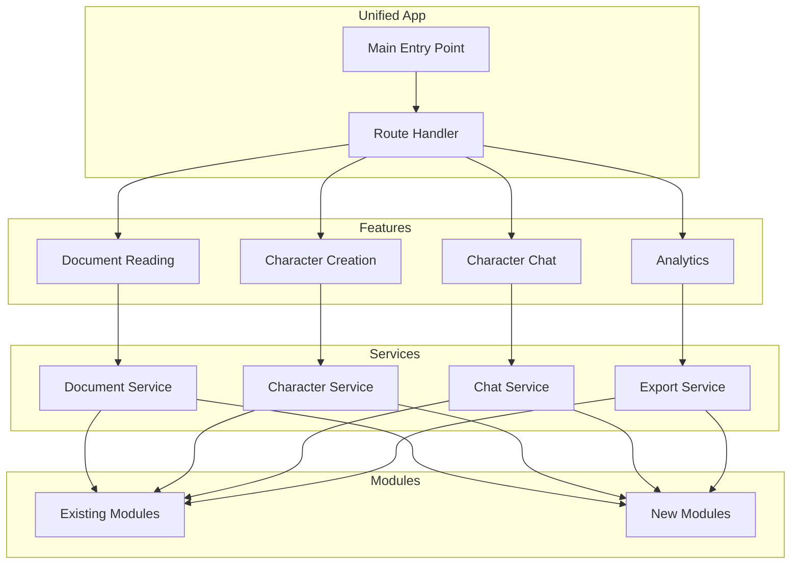

# Integration Architecture

## Overview
This document outlines the architecture for integrating the existing modules system with the character-creator system.

## High-Level Architecture

```
┌─────────────────────────────────────────────────────────────┐
│                     LiteraryAI Studio                        │
│                   (Unified Application)                      │
├─────────────────────────────────────────────────────────────┤
│                    Presentation Layer                        │
│  ┌─────────────┐  ┌──────────────┐  ┌──────────────────┐  │
│  │   Reader    │  │  Character   │  │      Chat        │  │
│  │    View     │  │   Gallery    │  │   Interface      │  │
│  └─────────────┘  └──────────────┘  └──────────────────┘  │
├─────────────────────────────────────────────────────────────┤
│                    Integration Layer                         │
│  ┌─────────────────────────────────────────────────────┐   │
│  │              Adapter Pattern Interfaces              │   │
│  ├─────────────┬──────────────┬────────────────────────┤   │
│  │  Document   │     NLP      │        LLM             │   │
│  │  Adapter    │   Adapter    │      Adapter           │   │
│  └─────────────┴──────────────┴────────────────────────┘   │
├─────────────────────────────────────────────────────────────┤
│                     Service Layer                            │
│  ┌──────────────┐  ┌──────────────┐  ┌────────────────┐   │
│  │   Document   │  │  Character   │  │     Chat       │   │
│  │   Services   │  │   Services   │  │   Services     │   │
│  └──────────────┘  └──────────────┘  └────────────────┘   │
├─────────────────────────────────────────────────────────────┤
│                     Module Layer                             │
│  ┌──────────────┐  ┌──────────────┐  ┌────────────────┐   │
│  │   Existing   │  │     New      │  │    Shared      │   │
│  │   Modules    │  │   Modules    │  │   Utilities    │   │
│  └──────────────┘  └──────────────┘  └────────────────┘   │
├─────────────────────────────────────────────────────────────┤
│                      Data Layer                              │
│  ┌──────────────┐  ┌──────────────┐  ┌────────────────┐   │
│  │   SQLite     │  │  Vector DB   │  │  File Storage  │   │
│  │   Database   │  │  (Future)    │  │    (S3/Local)  │   │
│  └──────────────┘  └──────────────┘  └────────────────┘   │
└─────────────────────────────────────────────────────────────┘
```

## Adapter Pattern Implementation

### Document Processing Adapter

```python
# character-creator/integrations/adapters/document_adapter.py

from abc import ABC, abstractmethod
from typing import Dict, Any, Optional
from pathlib import Path

class DocumentProcessorInterface(ABC):
    """Interface for document processing"""
    
    @abstractmethod
    def process_document(self, file_path: Path, options: Dict[str, Any]) -> Dict[str, Any]:
        """Process a document and return structured data"""
        pass
    
    @abstractmethod
    def extract_text(self, file_path: Path) -> str:
        """Extract plain text from document"""
        pass
    
    @abstractmethod
    def extract_metadata(self, file_path: Path) -> Dict[str, Any]:
        """Extract document metadata"""
        pass

class UniversalDocumentAdapter(DocumentProcessorInterface):
    """Adapter for the existing universal_document_reader module"""
    
    def __init__(self):
        # Import the existing module
        import sys
        sys.path.append('/workspace/modules')
        from universal_document_reader import UniversalDocumentReader
        self.reader = UniversalDocumentReader()
    
    def process_document(self, file_path: Path, options: Dict[str, Any]) -> Dict[str, Any]:
        # Adapt the existing interface to our new one
        result = self.reader.read_document(str(file_path))
        return {
            'success': True,
            'text': result.get('content', ''),
            'metadata': result.get('metadata', {}),
            'pages': result.get('pages', []),
            'document_reference': {
                'id': result.get('doc_id'),
                'path': str(file_path),
                'type': file_path.suffix[1:]
            }
        }
```

### NLP Processing Adapter

```python
# character-creator/integrations/adapters/nlp_adapter.py

class NLPProcessorInterface(ABC):
    """Interface for NLP processing"""
    
    @abstractmethod
    def analyze_text(self, text: str) -> Dict[str, Any]:
        """Perform comprehensive text analysis"""
        pass
    
    @abstractmethod
    def extract_entities(self, text: str) -> List[Dict[str, Any]]:
        """Extract named entities"""
        pass
    
    @abstractmethod
    def analyze_sentiment(self, text: str) -> Dict[str, float]:
        """Analyze sentiment"""
        pass

class IntelligentProcessorAdapter(NLPProcessorInterface):
    """Adapter for the existing intelligent_processor module"""
    
    def __init__(self):
        import sys
        sys.path.append('/workspace/modules')
        from intelligent_processor import IntelligentProcessor
        self.processor = IntelligentProcessor()
```

### LLM Service Adapter

```python
# character-creator/integrations/adapters/llm_adapter.py

class LLMInterface(ABC):
    """Interface for LLM services"""
    
    @abstractmethod
    async def generate_response(
        self, 
        prompt: str, 
        system_prompt: Optional[str] = None,
        **kwargs
    ) -> str:
        """Generate LLM response"""
        pass
    
    @abstractmethod
    def count_tokens(self, text: str) -> int:
        """Count tokens in text"""
        pass

class GPTDialogueAdapter(LLMInterface):
    """Adapter for the existing gpt_dialogue_generator module"""
    
    def __init__(self):
        import sys
        sys.path.append('/workspace/modules')
        from gpt_dialogue_generator import GPTDialogueGenerator
        self.generator = GPTDialogueGenerator()
```

## Integration Workflow

### Phase 1: Core Integration (Current)



### Phase 2: Enhanced Integration



## Directory Structure

```
/workspace/
├── app.py (existing main app)
├── character-creator/
│   ├── app/
│   │   └── main.py (character creator app)
│   ├── integrations/
│   │   ├── __init__.py
│   │   ├── adapters/
│   │   │   ├── __init__.py
│   │   │   ├── document_adapter.py
│   │   │   ├── nlp_adapter.py
│   │   │   └── llm_adapter.py
│   │   ├── interfaces/
│   │   │   ├── __init__.py
│   │   │   ├── document_interface.py
│   │   │   ├── nlp_interface.py
│   │   │   └── llm_interface.py
│   │   └── utils/
│   │       ├── __init__.py
│   │       ├── path_resolver.py
│   │       └── module_loader.py
│   ├── config/
│   ├── core/
│   ├── services/
│   └── ui/
├── modules/ (existing modules)
├── docs/
│   ├── integration_architecture.md
│   ├── module_dependencies.md
│   └── api_docs.md
└── tests/
    ├── integration/
    └── unit/
```

## Configuration Management

### Unified Configuration

```python
# character-creator/integrations/config.py

from dataclasses import dataclass
from typing import Optional
import os
from pathlib import Path

@dataclass
class IntegrationConfig:
    """Configuration for module integration"""
    
    # Paths
    modules_path: Path = Path("/workspace/modules")
    character_creator_path: Path = Path("/workspace/character-creator")
    
    # Feature flags
    use_enhanced_ocr: bool = True
    use_intelligent_processor: bool = True
    use_gpt_dialogue: bool = True
    
    # Performance
    enable_caching: bool = True
    cache_ttl: int = 3600
    
    # API Keys (from environment)
    openai_api_key: Optional[str] = os.getenv("OPENAI_API_KEY")
    anthropic_api_key: Optional[str] = os.getenv("ANTHROPIC_API_KEY")
```

## Error Handling Strategy

```python
# character-creator/integrations/exceptions.py

class IntegrationError(Exception):
    """Base exception for integration errors"""
    pass

class ModuleNotFoundError(IntegrationError):
    """Raised when a required module is not found"""
    pass

class AdapterError(IntegrationError):
    """Raised when adapter fails"""
    pass

class ConfigurationError(IntegrationError):
    """Raised when configuration is invalid"""
    pass
```

## Testing Strategy

### Integration Tests

```python
# tests/integration/test_document_adapter.py

import pytest
from character_creator.integrations.adapters import UniversalDocumentAdapter

def test_document_adapter_integration():
    """Test that document adapter correctly wraps universal_document_reader"""
    adapter = UniversalDocumentAdapter()
    result = adapter.process_document(Path("test.pdf"), {})
    assert result['success'] == True
    assert 'text' in result
    assert 'metadata' in result
```

## Migration Path

### Step 1: Parallel Operation
- Both systems run independently
- Shared database for common data
- Gradual feature migration

### Step 2: Unified Entry Point
- Single app.py that routes to both systems
- Shared session state
- Common authentication

### Step 3: Full Integration
- Complete module integration
- Unified UI components
- Single deployment unit

## Performance Considerations

1. **Lazy Loading**: Import modules only when needed
2. **Caching**: Redis for frequently accessed data
3. **Async Operations**: Use asyncio for I/O operations
4. **Resource Pooling**: Reuse expensive objects (NLP models)

## Security Considerations

1. **Input Validation**: All adapters validate input
2. **Sandboxing**: Module execution in controlled environment
3. **API Key Management**: Secure storage and rotation
4. **Rate Limiting**: Prevent abuse of expensive operations